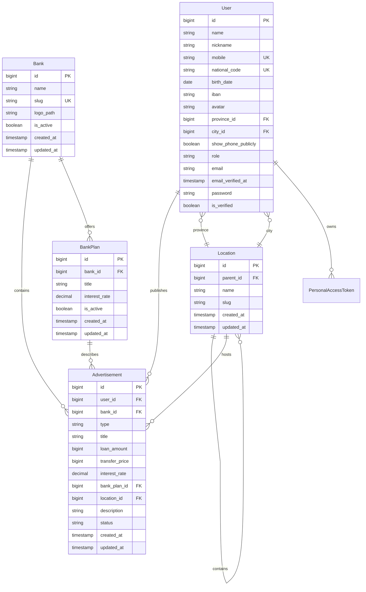
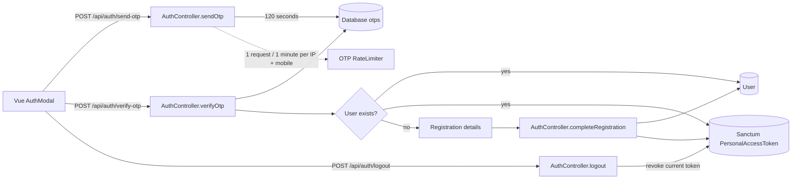
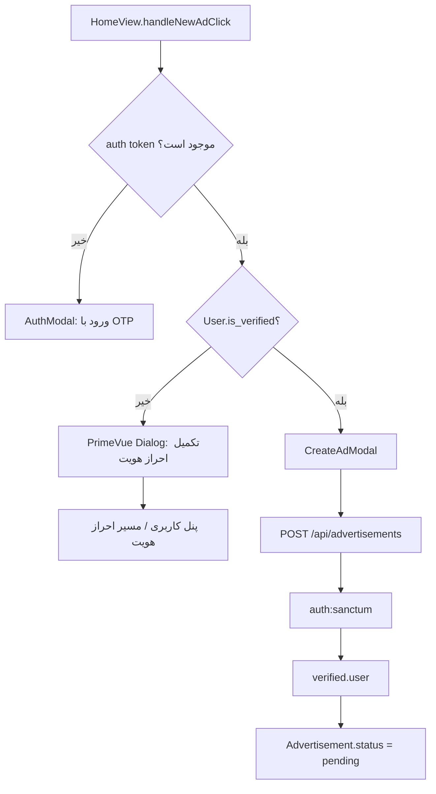
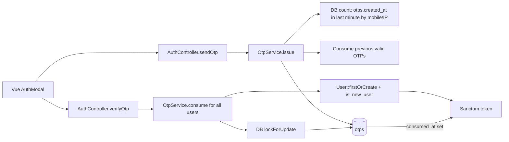
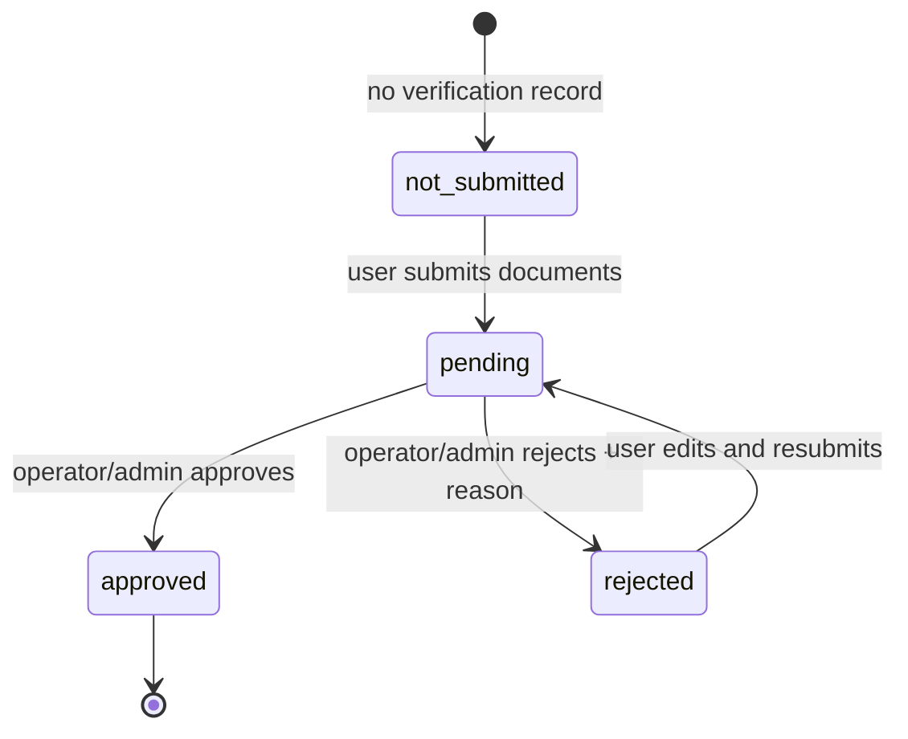
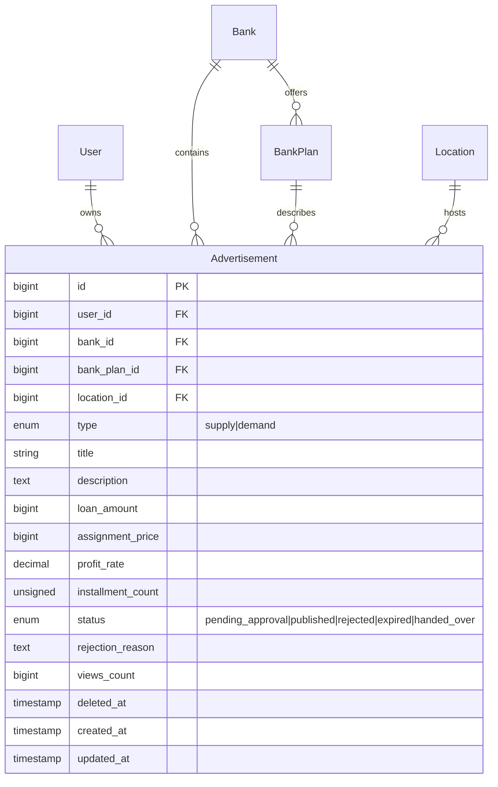
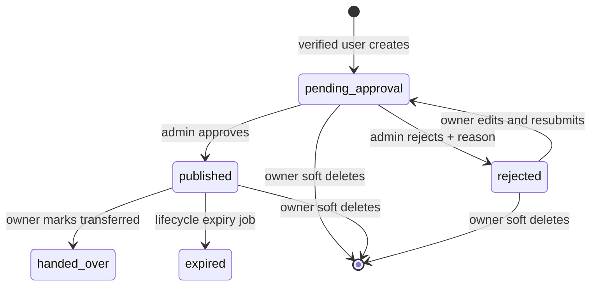
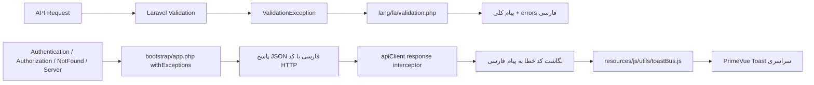
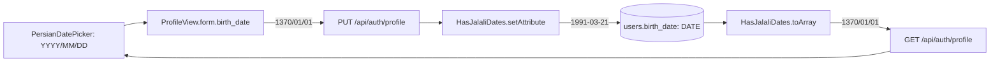

# Admin Portal Design System

صفحهٔ ورود ادمین در مسیر `/admin/login` یک سطح مستقل Enterprise برای کاربران مدیریتی است. ساختار بصری آن بر پایهٔ پس‌زمینهٔ `slate-950`، grid نورانی بسیار کم‌کنتراست، glow قرمز سازمانی `#A62626` و کارت glass با `backdrop-filter: blur` ساخته شده است؛ کارت در موبایل به‌صورت تک‌ستونه و فشرده، و در دسکتاپ با عرض محدود ۴۳۰ پیکسل نمایش داده می‌شود.

هدر کارت شامل لوگوی مستروام، بج monospace با عنوان `Enterprise Admin Portal`، عنوان سفید پرکنتراست «ورود به پنل مدیریت مستروام» و زیرعنوان سازمانی است. ورودی شناسه با آیکون کاربر و `dir=ltr` شماره موبایل یا ایمیل را می‌پذیرد. ورودی رمز از PrimeVue `Password` با `toggleMask` و آیکون چشم استفاده می‌کند؛ رنگ auto-fill مرورگر با زمینهٔ تیرهٔ کنترل‌شده، border slate و focus ring قرمز هم‌سطح می‌شود. کنترل‌های «مرا به خاطر بسپار» و «فراموشی رمز عبور؟» در یک ردیف RTL قرار دارند و دکمهٔ اصلی gradient قرمز، حالت disabled و spinner هنگام درخواست دارد.

فرم با payload استاندارد `{ username, password }` به `POST /api/admin/login` ارسال می‌شود؛ backend برای سازگاری، `identifier` قدیمی را نیز می‌پذیرد. پس از موفقیت، توکن Sanctum ذخیره، `GET /api/admin/me` برای نقش‌ها و مجوزها فراخوانی و کاربر به `/admin/dashboard` منتقل می‌شود. footer امنیتی با آیکون قفل اعلام می‌کند که فعالیت مدیران لاگ و رصد می‌شود. رفتار submit و loading در `AdminLoginView.test.js` با Vitest پوشش داده شده است.

## Operator dashboard REST architecture

داشبورد اپراتور از دادهٔ mock استفاده نمی‌کند. `GET /api/admin/dashboard/operator-stats` با middlewareهای Sanctum، نقش/مجوز و audit محافظت می‌شود و این داده‌ها را از دیتابیس برمی‌گرداند: تعداد آگهی‌های `pending_approval` یا legacy `pending`، تعداد پرونده‌های KYC با وضعیت `pending`، تعداد آگهی‌های `published` و `rejected` که امروز به‌روزرسانی شده‌اند، و پنج آگهی اخیر همراه `user` و `bank`. کوئری صف با `whereIn` و eager loading اجرا می‌شود تا N+1 ایجاد نشود.

مرزهای REST عملیاتی پنل عبارت‌اند از:

| مسیر | عمل | مجوز | نتیجه |
| --- | --- | --- | --- |
| `GET /api/admin/ads/pending` | فهرست صف آگهی | `ads.view` | pagination، جست‌وجوی عنوان/نام کاربر، user و bank |
| `POST /api/admin/ads/{advertisement}/approve` | تایید آگهی | `ads.approve` | تغییر وضعیت به `published` |
| `POST /api/admin/ads/{advertisement}/reject` | رد آگهی | `ads.reject` | تغییر وضعیت به `rejected` با `rejection_reason` اجباری |
| `GET /api/admin/users` | مدیریت کاربران | `users.view` | جست‌وجوی نام/موبایل و نقش‌ها |
| `PATCH /api/admin/users/{user}/status` | مسدودسازی/آزادسازی | `users.ban` | تغییر `users.is_banned` |
| `GET /api/admin/kyc/pending` | صف مدارک هویتی | `users.verify` | پرونده‌های pending همراه اطلاعات کاربر |

`AdminStore.loadOperatorStats()` یک پاسخ مشترک را برای `OperatorDashboardView` و `AdminLayout` نگه می‌دارد. آیتم‌های `navigation.js` دارای `countKey` هستند؛ لایوت مقادیر `pendingAdsCount` و `pendingKycCount` را به badge قرمز کوچک تبدیل می‌کند و با همان permission filtering، فقط منوهای مجاز نقش فعلی را نمایش می‌دهد. مسیرهای `/admin/dashboard`، `/admin/ads/pending`، `/admin/users` و `/admin/kyc` به viewهای عملیاتی متصل‌اند. هدر لایوت نام کاربر، نقش، اعلان، و خروج تأییدشده را ارائه می‌کند و محتوای اصلی با زمینهٔ `slate-50`، padding responsive و کارت‌های سفید رندر می‌شود.

در `OperatorDashboardView` نام اپراتور در badge مستقل از متن خوش‌آمدگویی render می‌شود تا شکست خط و overlap رخ ندهد. کارت صف سریع و کارت یادداشت‌ها در grid دوازده‌ستونه با نسبت ۸/۴ و `align-items: start` قرار دارند. جدول سریع با header خاکستری، سطرهای hover، badge بانک، مبلغ دوخطی، زمان نسبی و action button قرمز کم‌رنگ برای بازبینی استفاده می‌شود.

برای جلوگیری از تفسیر اشتباه تاریخ جلالی توسط JavaScript، endpoint آمار علاوه بر `created_at` نمایشی، `created_at_iso` را از `getRawOriginal('created_at')` برمی‌گرداند. داشبورد فقط ISO را برای محاسبه زمان نسبی استفاده می‌کند و خروجی‌هایی مانند «۱۰ دقیقه پیش»، «۲ ساعت پیش» یا تاریخ دقیق فارسی را نمایش می‌دهد؛ بنابراین سال‌های نادرستی مانند ۷۸۴ دیگر وارد `new Date()` نمی‌شوند.

### Pending advertisement review workflow

صف `/admin/ads/pending` در `PendingAdsView.vue` یک DataTable کارت‌محور با ستون‌های آگهی‌دهنده و وضعیت هویت، عنوان/بانک/طرح، نوع معامله، مبالغ، موقعیت، زمان ثبت و عملیات فوری دارد. فیلتر جست‌وجو عنوان، کد آگهی و موبایل را پوشش می‌دهد و `bank_id` صف را بر اساس بانک محدود می‌کند. پاسخ API با eager loading روابط `user`, `bank`, `bankPlan`, `location.parent` و pagination سمت سرور برمی‌گردد.

تایید از `PATCH /api/admin/ads/{advertisement}/approve` انجام می‌شود و ابتدا confirm سریع نمایش داده می‌شود؛ موفقیت، وضعیت را به `published` می‌برد و همان ردیف را از state جدول حذف می‌کند. رد از `POST /api/admin/ads/{advertisement}/reject` انجام می‌شود؛ Dialog PrimeVue دلایل متداول را با RadioButton و توضیح تکمیلی Textarea دریافت می‌کند و مقدار ترکیبی را به‌عنوان `rejection_reason` الزامی ارسال می‌کند. جزئیات کامل آگهی در Dialog جداگانه با `pi-eye` قابل بازبینی است. صف خالی پیام «عالی است! هیچ آگهی در انتظار بررسی وجود ندارد.» و آیکون سبز `pi-check-circle` دارد.

### Direct Ad Review Flow

دکمهٔ «بررسی» در جدول پنج آگهی اخیر داشبورد اپراتور، شناسهٔ رکورد را در `router.push({ name: 'admin.ads.pending', query: { reviewId: ad.id } })` قرار می‌دهد. دکمه تا تکمیل navigation با spinner همان ردیف disabled است. `PendingAdsView` پس از دریافت صف، `reviewId` را پیدا می‌کند و Dialog بررسی را خودکار باز می‌کند؛ اگر آگهی در صفحهٔ فعلی pagination نباشد، `GET /api/admin/ads/{advertisement}` جزئیات کامل کاربر، بانک، طرح و موقعیت را می‌خواند.

Dialog مستقیم شامل مشخصات تماس کاربر، توضیحات کامل، نرخ سود، مبلغ تسهیلات، قیمت واگذاری، اقساط و موقعیت است و سه مسیر عملیاتی دارد: `PATCH /api/admin/ads/{advertisement}/approve` برای تایید و انتشار، `POST /api/admin/ads/{advertisement}/reject` برای ثبت علت رد، و بازگشت به صف. اگر رکورد بین کلیک و عملیات تغییر وضعیت داده باشد، پیام خطای مناسب نمایش داده شده و صف با API دوباره همگام می‌شود.

## PrimeVue DataTable guidelines

جدول‌های مدیریت کاربران و صف KYC داخل کارت استاندارد سفید با `border-radius: 16px`, border خاکستری بسیار کم‌رنگ و shadow کوچک قرار می‌گیرند؛ هیچ خط مشکی یا جدول خام HTML استفاده نمی‌شود. DataTable با header خاکستری روشن، متن کوچک و ضخیم، padding سلول متعادل، جداکنندهٔ `gray-100` و hover ملایم `slate-50` تنظیم شده است. محتوای کاربر شامل avatar حرف اول، نام و موبایل monospace است و ایمیل خالی همیشه `-` نمایش داده می‌شود.

نقش‌ها با badgeهای semantic تفکیک می‌شوند: indigo برای مدیران، emerald برای مالی، sky برای اپراتور و gray برای کاربر بازار. وضعیت KYC با badge و آیکون PrimeIcons نمایش داده می‌شود. عملیات فقط دکمه‌های icon-based با tooltip/title دارد تا جدول متراکم و قابل اسکن بماند. toolbar کاربران شامل input group جست‌وجو و Selectهای نقش و وضعیت احراز هویت است.

هر دو جدول pagination سمت سرور Laravel را مصرف می‌کنند و `meta.current_page`, `meta.per_page` و `meta.total` را به PrimeVue `Paginator` می‌دهند؛ footer هم‌زمان بازه‌ای مانند «نمایش ۱۰ کاربر از ۳۵ کاربر» را نشان می‌دهد. KYC در نبود رکورد از empty state با `pi-inbox` و پیام کامل فارسی استفاده می‌کند و refresh button با `pi-refresh` وضعیت loading را نشان می‌دهد. کلاس‌های scoped موجود در viewها معادل tokenهای Tailwind مانند `bg-white`, `border-gray-200/80`, `rounded-2xl`, `shadow-sm`, `text-gray-700` و `hover:bg-slate-50/80` را پیاده می‌کنند تا با پوستهٔ فعلی Vite/PrimeVue سازگار بمانند.

### KYC review modal architecture

`AdminKycView` پروندهٔ انتخاب‌شده را در `selectedKyc` نگه می‌دارد و جزئیات کامل را از `GET /api/admin/kyc/{id}` دریافت می‌کند. Dialog با سطح سفید solid، header شامل نام کاربر، شماره پرونده و وضعیت، و سه تب مستقل ساخته شده است: اطلاعات هویتی، مدارک و تصاویر، و سوابق حساب/آگهی. مدارک از URLهای امن backend با PrimeVue Image preview و لینک download نمایش داده می‌شوند و checklist اعتبارسنجی اپراتور در تب مدارک قرار دارد.

تصمیم‌گیری از footer مودال انجام می‌شود: `PATCH /api/admin/kyc/{id}/approve` پرونده را approved و `User.is_verified` را true می‌کند؛ `POST /api/admin/kyc/{id}/reject` دلیل رد را ذخیره می‌کند تا کاربر بتواند ارسال مجدد انجام دهد. پس از موفقیت، رکورد بدون reload از صف حذف، `meta.total` کم و toast موفقیت نمایش داده می‌شود. خطاهای stale state با پیام فارسی و حفظ صف قابل refresh مدیریت می‌شوند. تاریخ ثبت با `Intl.DateTimeFormat('fa-IR-u-ca-persian')` و زمان نسبی امن نمایش داده می‌شود و شمارندهٔ footer از `meta.total` پاسخ Laravel استفاده می‌کند.

# Project Knowledge Graph



`User.is_verified` مشخص می‌کند کاربر اجازهٔ ثبت آگهی دارد یا نه و مقدار پیش‌فرض آن `false` است.

`Advertisement` دیگر ستون‌های متنی `plan` و `city` ندارد و مستقیماً به `BankPlan` و شهرِ `Location` متصل است. هر شهر با `parent_id` به استان خود وصل می‌شود و استان‌ها با `parent_id IS NULL` مشخص می‌شوند.

## Authentication API



The passwordless flow normalizes Persian and Arabic digits before validating Iranian mobile numbers with `^09[0-9]{9}$`, stores a random five-digit OTP in MySQL for 120 seconds, and limits each mobile/IP pair to one send per minute. `POST /api/auth/verify-otp` consumes the OTP atomically, creates a missing user with `is_verified=false`, assigns default roles, issues a Sanctum token, and returns `is_new_user` so the frontend can route first-time users toward profile/KYC completion while existing users continue normally. For local and testing environments only, the generated OTP is included in the structured creation log to support manual testing; production logs never contain the raw OTP.

## Marketplace API

```mermaid
flowchart LR
    Client[Vue HomeView] --> Ads[GET /api/advertisements]
    Client --> Detail[GET /api/advertisements/{id}]
    Client --> Banks[GET /api/banks]
    Ads --> Filter[Validated filters]
    Filter --> Approved[approved advertisements + active banks]
    Approved --> Resource[AdvertisementResource]
    Resource --> Client
    Detail --> Resource
    Banks --> Client
    Client[Vue HomeView] --> Locations[GET /api/locations/provinces]
    Client --> Plans[GET /api/banks/{id}/plans]
    Locations -->|province with children| Client
    Plans -->|active bank plans| Client
```

`GET /api/user/ads` با احراز هویت Sanctum فقط آگهی‌های متعلق به کاربر جاری را برمی‌گرداند. `BaseDashboardLayout` ظاهر حساب‌محور با پس‌زمینه `#F9FAFB`، سایدبار سفید، کارت پروفایل و وضعیت احراز هویت را فراهم می‌کند و `UserDashboardView` تب‌های وضعیت، کارت‌های مدیریت آگهی، empty state و کنترل‌های واکنش‌گرا را ارائه می‌دهد.

صفحه `AdDetailView` در مسیر `/advertisements/:id` جزئیات کامل یک آگهی تاییدشده را از `AdvertisementController.show` دریافت می‌کند. ریشهٔ محتوای صفحه با `grid grid-cols-1 lg:grid-cols-12 gap-6 items-start max-w-7xl mx-auto px-4 sm:px-6` پیاده شده است؛ ستون راست محتوا `lg:col-span-8 space-y-6` و ستون چپ سایدبار اکشن `lg:col-span-4 sticky top-24 space-y-4` است. ستون راست به‌ترتیب سربرگ آگهی، باکس سفید شرایط تسهیلات با ردیف‌های فشردهٔ مبلغ، سود/کارمزد، اقساط، قیمت واگذاری، نوع انتقال و وضعیت استعلام، کارت کهربایی `Safety Tips Card` و توضیحات آگهی را نمایش می‌دهد. سایدبار ثابت شامل کارت سفید هویت آگهی‌دهنده با بج احراز هویت و تاریخ‌های عضویت/انتشار، CTA قرمز دریافت اطلاعات تماس و گفتگو با عملیات نشان‌کردن/اشتراک‌گذاری، و کارت نقشه و محدوده جغرافیایی است. بخش‌های تکراری مشخصات و راهنمای معامله امن از صفحه حذف شده‌اند. اطلاعات تماس فقط پس از ورود و احراز کاربر نمایش داده می‌شود و کاربر مهمان به `AuthModal` هدایت می‌شود. پیشنهادهای مرتبط با `bank_id` در پایین صفحه با گرید سه‌ستونه و `AdCard` استاندارد بارگذاری می‌شوند.

مبالغ در `AdDetailView` با `Intl.NumberFormat('fa-IR')` جداکننده‌گذاری می‌شوند. `formatMillionMoney` برای مقادیر مدل که بر حسب میلیون تومان ذخیره شده‌اند و `formatCompactMoney` برای باکس اطلاعات تسهیلات استفاده می‌شود تا از نمایش مبهمی مثل `50000000 میلیون تومان` جلوگیری شود؛ مبلغ کل در ردیف خاکستری شاخص نمایش داده می‌شود و اقساط، کارمزد و نوع انتقال در خطوط مستقل و خوانا قرار دارند.

`GET /api/advertisements` فیلترهای `type`, `bank_id`, `bank_plan_id`, `location_id`, `min_amount`, `max_amount`, `search` و بازه قیمت را می‌پذیرد و فقط آگهی‌های `published` از بانک‌های فعال را برمی‌گرداند. این endpoint با `paginate(10)` صفحه‌بندی می‌شود. پارامتر `sort` نیز با مقدار پیش‌فرض `latest` پشتیبانی می‌شود: `latest` (تاریخ نزولی)، `amount_desc` (مبلغ نزولی)، `amount_asc` (مبلغ صعودی)، `price_asc` (قیمت واگذاری صعودی)، `price_desc` (قیمت واگذاری نزولی) و `rate_asc` (سود/کارمزد صعودی). مقدار نامعتبر به `latest` fallback می‌شود. کنترل `SortControls` در دسکتاپ به‌صورت `SelectButton` و در موبایل به‌صورت `Select` نمایش داده می‌شود و مقدار انتخاب‌شده را در `?sort=` نگه می‌دارد. `GET /api/banks` فقط بانک‌های فعال را برای فیلترهای صفحه اصلی ارائه می‌کند. داده‌های نمونه توسط `MarketplaceSeeder` پس از نقش‌ها و کاربران نمونه درج می‌شوند.

`GET /api/banks` برای هر بانک فعال از `withCount` روی relation `advertisements` استفاده می‌کند و فقط رکوردهای `status=published` را می‌شمارد؛ بنابراین تعداد آگهی هر بانک با یک query شمارشی به مدل بانک اضافه می‌شود و خروجی فیلد `advertisements_count` دارد. مجموع آگهی‌های منتشرشدهٔ بانک‌های فعال در `meta.published_advertisements_count` پاسخ قرار می‌گیرد تا گزینهٔ «همه بانک‌ها» در سایدبار بدون query جداگانهٔ فرانت نمایش داده شود.

### Public listing visual system

`HomeView` گرید آگهی‌های عمومی را با یک ستون در موبایل، دو ستون از breakpoint متوسط و سه ستون در نمایشگرهای بزرگ نمایش می‌دهد. `AdCard` هر آیتم را به کارت هم‌ارتفاع با گوشه‌های نرم، سایهٔ hover و فاصله‌گذاری ثابت تبدیل می‌کند: سربرگ شامل بج پاستلی نوع `واگذاری/تقاضا` و کادر بانک/طرح است؛ عنوان دوخطی، باکس مالی خاکستری با مبلغ و قیمت واگذاری، ردیف شهر/زمان و CTA قرمز `مشاهده آگهی` بخش‌های اصلی کارت هستند. مبالغ با `Intl.NumberFormat('fa-IR')` قالب‌بندی می‌شوند تا جداکنندهٔ سه‌رقمی فارسی داشته باشند.

Paginator صفحه عمومی، کامپوننت استاندارد PrimeVue است و metadata صفحه‌بندی Laravel را مصرف می‌کند. کنترل‌های first/previous/next/last با slotهای آیکون PrimeIcons (`pi-angle-double-right`, `pi-chevron-right`, `pi-chevron-left`, `pi-angle-double-left`) رندر می‌شوند؛ شماره‌ها مربع‌های نرم ۴۰ پیکسلی با border ملایم هستند، صفحه فعال پس‌زمینهٔ `#A62626` و سایهٔ قرمز کم‌رنگ دارد و کنترل غیرفعال با opacity پایین و cursor ممنوع نمایش داده می‌شود. کانتینر pagination با padding عمودی و تراز مرکزی رندر می‌شود و تغییر صفحه مقدار `?page=` را در URL نگه می‌دارد.

### Server-side pagination

لیست عمومی `GET /api/advertisements` فقط آگهی‌های `published` از بانک‌های فعال را برمی‌گرداند و به‌صورت پیش‌فرض با `paginate(10)` صفحه‌بندی می‌شود. مسیر canonical آگهی‌های کاربر، `GET /api/user/advertisements`، از relation کاربر جاری استفاده می‌کند، فیلتر `status` تب‌ها را حفظ می‌کند و با `paginate(10)` پاسخ می‌دهد. هر دو endpoint پارامتر اختیاری `page` را از Laravel و `per_page` را با پیش‌فرض ۱۰ و سقف ۵۰ می‌پذیرند.

ساختار JSON صفحه‌بندی Laravel بدون تغییر به فرانت منتقل می‌شود: `data` شامل رکوردهای همان صفحه است و `meta` شامل `current_page`, `last_page`, `total` و `per_page` است. `MyAdsView` متادیتای مسیر کاربر را مصرف می‌کند و با تغییر تب صفحه را به ۱ برمی‌گرداند؛ `HomeView` شماره صفحه را در `?page=` نگه می‌دارد تا refresh و اشتراک لینک همان صفحه را باز کنند. هر دو Paginator ده رکورد در صفحه دارند و صفحه فعال با رنگ سازمانی `#A62626` نمایش داده می‌شود.

## Advertisement creation access flow



روت `POST /api/advertisements` با `auth:sanctum` و `verified.user` محافظت می‌شود. مهمان پاسخ ۴۰۱ می‌گیرد، کاربر واردشدهٔ بدون احراز پاسخ ۴۰۳ با کد `USER_UNVERIFIED` دریافت می‌کند و فقط کاربر معتبر می‌تواند آگهی را با وضعیت `pending` ایجاد کند. `apiClient` این پاسخ ۴۰۳ را به رویداد `auth:unverified` تبدیل می‌کند تا رابط کاربری دیالوگ راهنما را نمایش دهد.

## Database OTP architecture



OTP هرگز در Cache لاراول ذخیره نمی‌شود. مدل `Otp` دارای `mobile`, `code`, `expires_at`, `consumed_at`, `ip_address` و `user_agent` است و ایندکس ترکیبی `mobile/consumed_at/expires_at` دارد. `OtpService` rate limit را با دیتابیس انجام می‌دهد، OTPهای قبلی معتبر را با `consumed_at` باطل می‌کند و verify موفق را در تراکنش با `lockForUpdate` مصرف می‌کند تا Replay هم‌زمان ممکن نباشد. لاگ‌های صدور، ابطال و اعتبارسنجی فقط شناسه OTP و شماره موبایل را ثبت می‌کنند و متن کد را ثبت نمی‌کنند.

## RBAC

```mermaid
flowchart LR
    OTP[AuthController.verifyOtp] -->|first login| Assign[syncRoles: buyer + seller]
    Assign --> User[User with Spatie HasRoles]
    User --> Buyer[buyer: create/search/request/offer]
    User --> Seller[seller: create/manage own ads]
    User --> Admin[super-admin/admin/operator]
    Admin --> AdminAPI[/api/admin/*]
    Operator[operator] --> OperatorAPI[/api/operator/*]
    AdminAPI --> Audit[LogRoleAccess]
    OperatorAPI --> Audit
    Audit --> Spatie[Spatie role middleware]
```

    ### Admin panel RBAC matrix

    | نقش | ads.* | finance.* | users.* | settings.manage | reports.view |
    | --- | --- | --- | --- | --- | --- |
    | `super_admin` | کامل | کامل | کامل | بله | بله |
    | `admin` | کامل | خیر | کامل | خیر | بله |
    | `financial_manager` | خیر | کامل | خیر | خیر | بله |
    | `operator` | view/approve/reject | خیر | view/verify | خیر | خیر |

    مجوزهای پنل با نام‌های دقیق `ads.view`, `ads.approve`, `ads.reject`, `ads.delete`, `finance.view`, `finance.export`, `finance.settle`, `users.view`, `users.verify`, `users.ban`, `settings.manage` و `reports.view` در `RolesAndPermissionsSeeder` ساخته می‌شوند. `AdminRbacSeeder` چهار کاربر تستی با نقش‌های پنل ایجاد می‌کند؛ پسورد تستی فقط برای محیط توسعه/تست است.

    ### Admin security boundary

    ```mermaid
    flowchart TD
        AdminClient[Vue AdminLayout] --> Guard[Vue Router meta.permission]
        Guard --> AdminStore[Pinia useAdminStore]
        AdminStore --> Me[GET /api/admin/me]
        Me --> Sanctum[auth:sanctum]
        Sanctum --> RolePermission[role_or_permission middleware]
        RolePermission --> AdminAPI[/api/admin/*]
        AdminAPI --> Audit[role.audit structured log]
        AdminAPI --> Spatie[Spatie roles and permissions]
        AdminStore --> Navigation[navigation.js filter]
        Navigation --> Can[v-can directive]
    ```

    مسیرهای `/api/admin/*` ابتدا با Sanctum احراز هویت می‌شوند و سپس به یکی از نقش‌های پنل نیاز دارند؛ endpointهای جزئی‌تر با مجوزهایی مانند `finance.view` و `users.verify` محدود شده‌اند. `GET /api/admin/me` کاربر جاری، نام نقش‌ها و فهرست یکتای مجوزها را برمی‌گرداند. در فرانت، `AdminLayout` منوی مشترک `navigation.js` را با store مجوزها فیلتر می‌کند، guard برای ورود مستقیم به URL، `meta.permission` را بررسی و در صورت شکست به `/403` هدایت می‌کند، و `v-can` کنترل‌های حساس داخل صفحه را غیرفعال می‌سازد.

    ### Admin test accounts and password login

    `AdminUsersSeeder` پس از اجرای `RolesAndPermissionsSeeder` نقش‌های لازم را با `Role::findOrFail` بررسی کرده و حساب‌های زیر را با `updateOrCreate` می‌سازد. رمز مشترک همه حساب‌ها `Admin@123456` است و فقط برای محیط لوکال/تست استفاده می‌شود:

    | نقش | نام | موبایل | ایمیل |
    | --- | --- | --- | --- |
    | `super_admin` | علی رادمنش | `09120000001` | `superadmin@mestroam.ir` |
    | `admin` | سارا رضایی | `09120000002` | `admin@mestroam.ir` |
    | `financial_manager` | محمد حسینی | `09120000003` | `finance@mestroam.ir` |
    | `operator` | مهسا مرادی | `09120000004` | `operator@mestroam.ir` |
    | `auditor` | رضا کمالی | `09120000005` | `auditor@mestroam.ir` |

    فرم ورود در `/admin/login` شماره موبایل یا ایمیل و رمز عبور را می‌پذیرد و به `POST /api/admin/login` متصل است. پاسخ، توکن Sanctum و کاربر را برمی‌گرداند؛ فرانت توکن را ذخیره کرده، `GET /api/admin/me` را برای نقش‌ها/مجوزها فراخوانی می‌کند و سپس به `/admin/dashboard` می‌رود. اجرای مستقیم سیدر:

    ```bash
    php artisan db:seed --class=AdminUsersSeeder
    ```

نقش‌ها و مجوزها در `RolesAndPermissionsSeeder` تعریف می‌شوند. `User` از trait رسمی `HasRoles` استفاده می‌کند و با `syncRoles` چند نقش هم‌زمان می‌گیرد. روت‌های admin و operator با `auth:sanctum`، middleware audit و middleware رسمی `role` محافظت می‌شوند و کاربر فاقد نقش پاسخ ۴۰۳ دریافت می‌کند. guard فرانت با فرمت `[AuthGuard:checkRole]` مسیر پنل کاربر یا ادمین را تعیین می‌کند؛ این guard جایگزین مجوز backend نیست.

## Frontend Index

صفحه اصلی در `resources/js/components/HomeView.vue` با Vue 3 و Composition API ساخته شده است و از `AdCard.vue` برای نمایش آگهی‌ها استفاده می‌کند. هر دو کامپوننت داخل Blade با mount point به نام `#app` رندر می‌شوند و کل رابط کاربری راست‌چین و واکنش‌گرا است. صفحه از الگوی مینیمال دیوار استفاده می‌کند: هدر چسبان، فیلترهای متنی در ستون راست، و گرید کارت‌های آگهی در فضای باقی‌مانده. بنرهای حجیم و وابستگی PrimeVue حذف شده‌اند و کنترل‌های فرم به HTML بومی منتقل شده‌اند.

### Frontend setup

پکیج `vue` و `primeicons` در پروژه نصب شده‌اند. در `resources/js/app.js`، Vue با آیکون‌های سبک PrimeIcons mount می‌شود و برای کامپایل فایل‌های `.vue` نیز `@vitejs/plugin-vue` در `vite.config.js` فعال است. فونت اصلی ایران‌سنس به‌صورت محلی در `resources/fonts/IRANSans-Regular.woff2`، `IRANSans-Medium.woff2` و `IRANSans-Bold.woff2` قرار دارد و در `resources/css/app.css` با `@font-face` برای کل پروژه اعمال شده است.

فهرست‌های HomeView از `GET /api/advertisements` و `GET /api/banks` دریافت می‌شوند و دیگر داده‌ی mock در کامپوننت وجود ندارد. لایه شبکه در مسیر دقیق `src/resources/js/services` قرار دارد: `apiClient.js` کلاینت Axios و interceptorهای احراز هویت را فراهم می‌کند، `adService.js` عملیات آگهی، `bankService.js` عملیات بانک و `authService.js` جریان OTP و session را مدیریت می‌کنند؛ `index.js` export مرکزی این سرویس‌ها است. تست‌های کامپوننتی و سرویس‌ها با دستور `npm run test` اجرا می‌شوند.

## Dashboard architecture

داشبوردها با Vue Router، Pinia و الگوی layout مشترک Sakai پیاده‌سازی شده‌اند. `BaseDashboardLayout.vue` مسئول قاب RTL، هدر و کانتینر اصلی است و `AppMenu.vue` فقط config منوی دریافت‌شده را render می‌کند؛ بنابراین منوی کاربر و ادمین هیچ state یا گزینه مشترک ناخواسته‌ای ندارند.

### Nested user dashboard routes

```mermaid
flowchart TD
    UserPanel[/user] --> MyAds[MyAdsView]
    UserPanel --> Bookmarks[BookmarksView]
    UserPanel --> Profile[ProfileView]
    UserPanel --> History[HistoryView]
    UserPanel --> Verification[VerificationView]
    UserPanel --> Settings[SettingsView]
    MyAds --> LoadMyAds[adService.getMyAds(status)]
    Bookmarks --> LoadBookmarks[adService.getBookmarks()]
    Profile --> UpdateProfile[authService.updateProfile()]
    Verification --> SubmitKyc[authService.submitKyc(formData)]
    History --> LocalStorage[recent_ads]
    Settings --> SavePreferences[local state + logger]
```

مسیرهای تودرتو پنل کاربری در `resources/js/router/index.js` با نام‌های `user.my-ads`, `user.bookmarks`, `user.profile`, `user.history`, `user.verification` و `user.settings` تعریف شده‌اند. کل محتوای اصلی از `RouterView` داخل `BaseDashboardLayout` رندر می‌شود و گزینه‌های سایدبار از `resources/js/config/menus.js` به‌صورت ماژولار و مستقل از منوی ادمین مدیریت می‌شوند. همچنین خروج از حساب با دیالوگ تأیید در `BaseDashboardLayout` و فراخوانی `authService.logout()` انجام می‌شود.

### User dashboard module integrations

- `MyAdsView` فیلتر وضعیت را داخل پنل فیلترهای پیشرفته به `adService.getMyAds(filters, page, perPage)` می‌فرستد. صفحهٔ آگهی‌ها در یک کانتینر محدود و responsive نمایش داده می‌شود و نتیجه‌ها در DataTable قابل اسکرول افقی هستند.
- کارت آگهی شامل سربرگ بانک و بج وضعیت رنگی، بدنهٔ عنوان و مبالغ قالب‌بندی‌شدهٔ سه‌رقمی، شهر و فوتر عملیات است. فوتر تاریخ شمسی/نسبی ثبت و دکمه‌های آیکون‌دار مشاهده، ویرایش، واگذاری و حذف با tooltip را نگه می‌دارد.
- `Paginator` استاندارد PrimeVue در پایین گرید با `rows=10`، `first=(currentPage - 1) * 10` و متادیتای Laravel رندر می‌شود. صفحه‌های آن کپسولی و وسط‌چین هستند، صفحهٔ فعال رنگ `#A62626` دارد و slotهای `prevpagelinkicon` و `nextpagelinkicon` به‌ترتیب `pi pi-chevron-right` و `pi pi-chevron-left` را در رابط RTL نمایش می‌دهند. تغییر تب صفحه را به ۱ برمی‌گرداند و تغییر صفحه به ابتدای صفحه اسکرول می‌کند.
- `MyAdsView` اکنون نمای اصلی را به `PrimeVue DataTable` با ستون‌های کد، عنوان/بانک، نوع، مبالغ، موقعیت، وضعیت، تاریخ و عملیات تبدیل می‌کند. وضعیت‌ها با `Tag` و severity استاندارد نمایش داده می‌شوند و علت رد با tooltip روی بج وضعیت قابل مشاهده است. عملیات شامل مشاهده در تب جدید، ویرایش، علامت‌گذاری واگذاری و حذف با دیالوگ تایید است.
- بالای جدول `Quick Bank Filter Bar` با گزینهٔ «همه بانک‌ها» و کارت‌های بانک‌های دریافت‌شده از `GET /api/banks` قرار دارد؛ بانک انتخاب‌شده با border و ring قرمز مشخص می‌شود. پنل فیلتر پیشرفته شامل جستجوی عنوان/کد، نوع، وضعیت، بازه مبلغ و قیمت، استان و شهر وابسته است و با اعمال یا پاک‌سازی، صفحه به ۱ برمی‌گردد.
- `GET /api/user/advertisements` allowlist فیلترهای `search`, `type`, `bank_id`, `min_amount`, `max_amount`, `min_price`, `max_price`, `province_id`, `location_id` و `status` را به query امن تبدیل می‌کند. `page` و `per_page` همراه همه فیلترها حفظ می‌شوند و پاسخ همچنان metadata استاندارد Laravel را برمی‌گرداند.
- استایل نهایی `MyAdsView` پنل فیلتر پیشرفته را در کارت `bg-gray-50/70` با گرید responsive قرار می‌دهد. تمام انتخاب‌ها با PrimeVue `Dropdown` و `panelClass` سفید، border و shadow استاندارد و slot گزینهٔ دارای padding/hover رندر می‌شوند؛ استان و شهر به‌صورت وابسته عمل می‌کنند و footer پنل دکمه‌های اعمال و پاک‌سازی را در یک ردیف نگه می‌دارد.
- فرم فیلتر پیشرفته سه ردیف ثابت دارد: جستجو با span دو ستون در کنار نوع و وضعیت، استان و شهر هرکدام دو ستون، و چهار ورودی مالی در ردیف سوم. `InputText` و `InputNumber` کادر سفید، border خاکستری، focus ring قرمز و placeholder خوانا دارند؛ ورودی‌های مالی با `locale="fa-IR"` گروه‌بندی سه‌رقمی می‌شوند و پسوند ثابت «تومان» در سمت چپ دارند. لیبل‌ها bold و بالای کنترل قرار گرفته‌اند.
- کنترل‌های PrimeVue `Dropdown` نیز با override مستقیم روی root/label/trigger استاندارد شده‌اند: root سفید با ارتفاع ۴۴ پیکسل، border خاکستری، radius دوازده پیکسل و shadow ملایم دارد؛ label padding و رنگ خوانا دارد، trigger عرض ثابت و آیکون خاکستری دارد و focus با border/ring قرمز نمایش داده می‌شود. حالت disabled شهر پس‌زمینهٔ خاکستری و opacity پایین دارد.
- `MyAdsView` در داشبورد از کانتینر full-width با سقف `1600px` و padding واکنش‌گرا استفاده می‌کند؛ والد `dashboard-main` نیز با `min-width: 0` اجازهٔ فشرده‌سازی ناخواسته را نمی‌دهد. جدول آگهی‌ها با `width: 100%`, `table-layout: fixed` و ستون‌های درصدی جمعاً ۱۰۰٪ رندر می‌شود، wrapper آن overflow افقی ندارد و در breakpointهای کوچک به حالت responsive/stack تبدیل می‌شود. کد آگهی در محدودهٔ جدول با عنوان قابل مشاهده است و ستون‌ها برای تاریخ، وضعیت و عملیات از شکست متن جلوگیری می‌کنند.
- نوار بانک‌های `MyAdsView` از لوگوهای شفاف محلی در `public/images/banks/` استفاده می‌کند (`resalat.svg`, `melli.svg`, `keshavarzi.svg`, `saderat.svg`, `mehr-iran.svg`, `maskan.svg`, `tejarat.svg`, `sepah.svg`) و در صورت وجود `logo_path` از تصویر API مقدم استفاده می‌کند. کارت فعال border/ring قرمز سازمانی دارد و نوار به‌صورت افقی scrollable است.
- DataTable با حداقل عرض برای ستون‌های عنوان، وضعیت و تاریخ و `white-space: nowrap` برای سلول‌های تک‌خطی از شکست تک‌حرفی جلوگیری می‌کند. Paginator استاندارد PrimeVue در پایین جدول با شماره‌های نرم، صفحه فعال `#A62626` و آیکون‌های chevron راست‌چین قرار دارد.
- `CreateAdModal` با `bankService.getAll()` و `bankService.getPlans(bankId)` داده‌های بانک و طرح را می‌گیرد و پس از ساخت فرم، با `adService.create(payload)` ارسال می‌کند.
- `VerificationView` فرم KYC را با `authService.submitKyc(formData)` ارسال می‌کند و وضعیت را در UI نشان می‌دهد.
- `ProfileView` و `SettingsView` به‌صورت ماژولار روی state‌های Pinia و فرم‌های محلی اجرا می‌شوند.
- `HistoryView` شناسه آگهی‌های اخیر را در `localStorage` با کلید `recent_ads` نگه می‌دارد.

### Bookmark architecture

بوک‌مارک‌ها فقط در جدول واسط `bookmarks` با ستون‌های `user_id` و `advertisement_id` نگه‌داری می‌شوند و روی این دو ستون یک unique constraint وجود دارد. رابطه `User::bookmarks()` رکوردهای pivot متعلق به همان کاربر را برمی‌گرداند و `Bookmark::advertisement()` آگهی مرتبط را resolve می‌کند؛ `Advertisement::bookmarkedBy()` رابطه معکوس است.

```mermaid
flowchart LR
    Detail[AdDetailView] --> Toggle[POST /api/user/bookmarks/{advertisementId}]
    Toggle --> BookmarkController[BookmarkController.toggle]
    BookmarkController --> Pivot[(bookmarks: user_id + advertisement_id)]
    Panel[BookmarksView] --> Fetch[GET /api/user/bookmarks]
    Fetch --> BookmarkIndex[BookmarkController.index]
    BookmarkIndex --> UserRelation[request.user.bookmarks]
    UserRelation --> Pivot
    Panel --> Remove[DELETE /api/user/bookmarks/{advertisementId}]
    Remove --> BookmarkDelete[BookmarkController.destroy]
    BookmarkDelete --> Pivot
```

هر سه endpoint زیر `auth:sanctum` هستند. `GET /api/user/bookmarks` با relation کاربر جاری و eager loading روابط `advertisement.bank`, `advertisement.bankPlan`, `advertisement.location` و `advertisement.user` اجرا می‌شود و هرگز از `Advertisement::all()` استفاده نمی‌کند. toggle آگهی approved را برای همان کاربر ایجاد یا حذف می‌کند و پاسخ `bookmarked` را برمی‌گرداند؛ حذف نیز فقط رکورد pivot همان کاربر را حذف می‌کند. `BookmarksView` مقدار اولیه `bookmarks` را آرایه خالی می‌گذارد و فقط پاسخ واقعی API را پس از فیلتر شناسه‌دار نمایش می‌دهد؛ وضعیت خالی شامل پیام «هنوز هیچ آگهی را نشان نکرده‌اید» و بازگشت به صفحه آگهی‌هاست. لاگ‌های ساختاری fetch با تگ `[Bookmarks:fetch]` در هر دو لایه ثبت می‌شوند و تست جداسازی مالکیت در `tests/Feature/BookmarkTest.php` قرار دارد.

## Profile API and user data

آپلود آواتار از مسیر `POST /api/user/profile/avatar` با middleware `auth:sanctum` انجام می‌شود. ورودی multipart باید فیلد `avatar` با نوع تصویر JPG/JPEG/PNG/WEBP و حداکثر ۲MB باشد. فایل در دیسک `public` و مسیر `avatars/` ذخیره می‌شود، آواتار قبلی پیش از ذخیرهٔ فایل جدید حذف می‌شود و پاسخ شامل پیام فارسی، `avatar_url` معتبر و آبجکت تازهٔ `user` است. لینک `public/storage` با `php artisan storage:link` به `storage/app/public` متصل است. `ProfileView` پس از پاسخ موفق، هم state محلی و هم `useAuthStore.user` و localStorage را همان لحظه به‌روزرسانی می‌کند و خطا/موفقیت را با PrimeVue Toast نشان می‌دهد.
برای سرو قطعی تصویر، `GET /api/user/profile/avatar` نیز با `auth:sanctum` فایل آواتار کاربر جاری را از دیسک public stream می‌کند. `ProfileView` این endpoint را با Axios و `responseType: blob` می‌خواند و object URL می‌سازد؛ بنابراین حتی وقتی web server مسیر junction `public/storage` را به fallback HTML resolve کند، تصویر با Bearer token و MIME واقعی نمایش داده می‌شود.

## Full KYC and operator review

```mermaid
erDiagram
    User ||--o{ UserVerification : submits

    UserVerification {
        bigint id PK
        bigint user_id FK UK
        string home_phone
        text postal_address
        string residence_document_path
        string national_code
        string national_card_serial
        string national_card_front_path
        string national_card_back_path
        string birth_certificate_p1_path
        string birth_certificate_p2_path
        string job_document_path
        string iban
        boolean ownership_confirmed
        enum status "pending|approved|rejected"
        bigint reviewed_by FK
        timestamp reviewed_at
        text rejection_reason
    }
```

کاربر از `GET /api/user/kyc/status` آخرین پرونده و از `GET /api/user/kyc/history` تمام درخواست‌های خود را به ترتیب نزولی می‌خواند. مدارک با `POST /api/user/kyc/submit` به‌صورت `multipart/form-data` ارسال می‌شوند. اگر رابطهٔ `UserVerification` وجود نداشته باشد، پاسخ دقیقاً `status: not_submitted` و `data: null` دارد و فرم کامل بدون قفل نمایش داده می‌شود. جدول تاریخچه شامل شماره درخواست، تاریخ ثبت شمسی، وضعیت، علت رد و تاریخ بررسی است.

علت خطای ۵۰۰ ثبت‌شده در لاگ، تلاش submit برای به‌روزرسانی `users.national_code` با کدی بود که قبلاً متعلق به کاربر دیگری بود و به `users_national_code_unique` برخورد می‌کرد. `SubmitUserVerificationRequest` اکنون یکتایی کد ملی را با نادیده گرفتن کاربر جاری اعتبارسنجی می‌کند و چنین خطایی را قبل از تراکنش با پاسخ ۴۲۲ فارسی برمی‌گرداند. سرویس قبل از ذخیره پوشهٔ خصوصی را می‌سازد و هر مسیر فایل را فقط پس از `hasFile` ذخیره می‌کند؛ خطاهای پیش‌بینی‌نشدهٔ submit نیز با تگ `[KYC:SubmitFailed]` و بدون اطلاعات حساس لاگ می‌شوند. در فرانت‌اند، Axios برای `FormData` هدر `Content-Type` را دستی قفل نمی‌کند تا boundary صحیح را خودش بسازد و تعهدنامه با مقدار `1` ارسال می‌شود.

رابطهٔ `User` با `UserVerification` اکنون یک‌به‌چند است و unique قبلی `user_id` با migration چنددرخواستی حذف شده است. قانون چرخهٔ عمر این است: پروندهٔ `approved` یا هر `pending` فعال، ارسال جدید را با خطای ۴۲۲ مسدود می‌کند؛ فقط وقتی آخرین پرونده `rejected` باشد، submit یک رکورد جدید با وضعیت `pending` می‌سازد. `VerificationView` تاریخچه را با PrimeVue DataTable نمایش می‌دهد و عملیات «اصلاح و ارسال مجدد» را فقط برای آخرین ردشده فعال می‌کند.

`User.is_verified` پرچم دسترسی عملیاتی و همتای sync‌شدهٔ وضعیت `UserVerification.status=approved` است. کنترلر review هنگام تایید یا رد، هر دو رکورد را در یک تراکنش به‌روزرسانی می‌کند؛ middleware `EnsureUserIsVerified` مقدار تازهٔ `is_verified` را می‌خواند و با تگ `[Gate:CheckVerification]` نتیجهٔ گیت را لاگ می‌کند. برای جلوگیری از باقی‌ماندن snapshot قدیمی login، router guard پیش از مسیرهای احراز‌شده پروفایل کاربر را از API refresh و در Pinia/localStorage ذخیره می‌کند.

در پنل ادمین، فایل‌های KYC در دیسک خصوصی `local` باقی می‌مانند و هرگز از `public/storage` سرو نمی‌شوند. پاسخ `GET /api/admin/kyc/{verification}` برای سه مدرک اصلی (`id_card_front_url`, `id_card_back_url`, `residence_doc_url`) لینک موقت دو ساعته با `URL::temporarySignedRoute` تولید می‌کند. مسیر `GET /api/admin/kyc/media/{kyc}/{type}` خارج از احراز هویت session، اما پشت middleware `signed`، امضای URL را بررسی کرده و فایل را با `Storage::disk('local')->response($path)` به‌صورت inline به مرورگر می‌دهد؛ نوع مدرک نیز فقط به فیلدهای مجاز مدل نگاشت می‌شود. بنابراین تگ تصویر و لینک دانلود مرورگر بدون Bearer token کار می‌کنند، ولی مسیر خام فایل یا URL بدون امضای معتبر قابل استفاده نیست. `AdminKycView` برای لینک‌های غایب یا خطادار کارت fallback وکتوری نشان می‌دهد و preview PrimeVue را روی URL امضاشده باز می‌کند.

اپراتور یا ادمین دارای مجوز `review-kyc`، صف را از `GET /api/admin/verifications?status=pending` می‌خواند، جزئیات را از `GET /api/admin/verifications/{id}` دریافت می‌کند و مدارک را فقط از مسیر دانلود امن همان API مشاهده می‌کند. نتیجه با `PATCH /api/admin/verifications/{id}/review` ثبت می‌شود: تایید، `User.is_verified` را `true` می‌کند و رد، دلیل رد را ذخیره و دسترسی تاییدشده را غیرفعال نگه می‌دارد.



`VerificationView` تا دریافت پاسخ API در حالت loading است؛ مقدار اولیهٔ status هرگز `pending` نیست. وضعیت `pending` فرم را قفل و پیام صف بررسی را همراه تاریخ ارسال نشان می‌دهد، `approved` کارت سبز تایید را نشان می‌دهد و `rejected` دلیل رد و دکمهٔ ویرایش و ارسال مجدد را نمایش می‌دهد. ارسال مجدد، داده‌های متنی قبلی را در فرم نگه می‌دارد و پس از اصلاح مدارک وضعیت را دوباره `pending` می‌کند.

در بازطراحی UI، محتوای `VerificationView` داخل کانتینر محدود و responsive با فاصلهٔ عمودی یکنواخت قرار دارد. بنر pending به کارت کهربایی ساختاریافته با آیکون ساعت، توضیح فرایند و بج تاریخ ارسال تبدیل شده و تاریخچه داخل کارت سفید با PrimeVue DataTable، هدرهای خاکستری ملایم، Tagهای وضعیت و اسکرول افقی موبایل ارائه می‌شود. لاگ `[VerificationView:renderHistory]` تعداد رکوردها و وضعیت آخرین پرونده را هنگام render تاریخچه ثبت می‌کند.

`TestUserAdsSeeder` برای کاربر ۸، ۳۰ آگهی تستی با وضعیت‌های `published=10`، `pending_approval=8`، `rejected=6`، `handed_over=4` و `expired=2` می‌سازد و FKهای بانک، طرح و شهر را از دیتابیس انتخاب می‌کند. `MyAdsView` تب‌های ردشده و منقضی را جداگانه نمایش می‌دهد تا شمارندهٔ ردشده دقیقاً ۶ و شمارندهٔ منقضی ۲ باشد؛ تب همه نیز هر ۳۰ رکورد را نشان می‌دهد.

در ستون عملیات، پرونده‌های `pending` و `approved` دکمهٔ «مشاهده مدارک» دارند که Dialog فقط‌خواندنی جزئیات متنی و thumbnail مدارک را باز می‌کند؛ تصاویر بزرگ با کلیک روی thumbnail نمایش داده می‌شوند. پروندهٔ `rejected` فقط دکمهٔ «اصلاح و ارسال مجدد» دارد و متن خام `---` در عملیات استفاده نمی‌شود. جزئیات از `GET /api/user/kyc/{id}/details` و فایل‌ها از `GET /api/user/kyc/{id}/documents/{type}` دریافت می‌شوند؛ هر دو endpoint مالکیت رکورد را با relation کاربر جاری کنترل می‌کنند و فایل‌ها از دیسک خصوصی stream می‌شوند.

Dialog جزئیات با `modal="true"` و mask نیمه‌شفاف تیره/blur شده render می‌شود؛ root، header، content و footer به‌صورت explicit سفید و مات هستند، content اسکرول داخلی با سقف ۸۵٪ viewport دارد و عرض Dialog در موبایل به ۹۰٪ viewport محدود می‌شود. این تنظیمات از نفوذ بصری محتوای صفحهٔ زیرین به مودال جلوگیری می‌کنند و دکمهٔ close داخلی و footer هر دو Dialog را می‌بندند.

`VerificationAccessDialog` نیز با حذف عنوان header پیش‌فرض و انتقال عنوان به جریان عمودی محتوای اصلی بازطراحی شده است. Dialog عرض `90vw` با سقف ۴۴۰ پیکسل دارد، محتوای آن پدینگ ۲۴ پیکسل و فاصلهٔ استاندارد بین آیکون، عنوان، توضیح و CTA دارد؛ دکمهٔ close در RTL با فاصلهٔ ۱۶ پیکسل از گوشهٔ چپ قرار می‌گیرد و سطح content به‌صورت global سفید و مات نگه داشته می‌شود تا resetهای CSS باعث فشردگی یا شفافیت نشوند.

## Advertisement lifecycle management

### Lifecycle data model



`advertisements` از Soft Delete استفاده می‌کند. مقدارهای legacy (`pending`, `approved`, `closed` و فیلدهای `transfer_price`/`interest_rate`) فقط برای سازگاری migration و کلاینت‌های قدیمی نگه داشته شده‌اند؛ قرارداد جدید از `assignment_price`, `profit_rate` و وضعیت‌های استاندارد lifecycle استفاده می‌کند.

### Status transitions



### REST API and authorization

```mermaid
flowchart LR
    Wizard[AdWizard / CreateAdModal] -->|POST /api/advertisements| Store[AdvertisementController.store]
    Store --> Verify[auth:sanctum + verified.user]
    Verify --> Pending[pending_approval]
    Panel[MyAdsView] -->|GET /api/user/advertisements?status=...| Mine[AdvertisementController.userAds]
    Panel -->|PUT /api/user/advertisements/{id}| Update[AdvertisementController.update]
    Panel -->|PATCH /api/user/advertisements/{id}/status| Transfer[changeStatus]
    Panel -->|DELETE /api/user/advertisements/{id}| Delete[destroy + SoftDeletes]
    Update --> Policy[AdvertisementPolicy ownership check]
    Transfer --> Policy
    Delete --> Policy
    Update --> Pending
    Transfer --> HandedOver[handed_over]
```

The create and update payloads are validated by `StoreAdvertisementRequest`: bank plans must belong to the selected bank, locations must be cities, amounts are positive, titles are at least 10 characters and cannot contain phone numbers, and financial/installment values are bounded. `AdvertisementPolicy` restricts update, status change, and deletion to the owner. Every controller action writes structured context logs.

### Panel components

- `AdWizard.vue`: three-step bank, financial, and location/content workflow; loads bank plans when the bank changes, formats money inputs, and supports create/edit modes.
- `CreateAdModal.vue`: modal shell for the home page creation flow; closes after success and emits the created advertisement.
- `MyAdsView.vue`: status tabs, lifecycle badges, rejection reason, edit wizard, handed-over action, and delete confirmation dialog.
- `adService.js` and `useUserAds.js`: centralized REST calls and Pinia loading/state management with structured frontend logging.

## Error handling and localization

## Global verification access gate

```mermaid
flowchart TD
        Request[Authenticated API request] --> Auth[auth:sanctum]
        Auth --> Gate{is_verified?}
        Gate -->|true| Continue[Protected controller action]
        Gate -->|false| Allowed{Profile, KYC, or logout?}
        Allowed -->|yes| Continue
        Allowed -->|no| Denied[403 KYC_REQUIRED]
        Denied --> Interceptor[apiClient response interceptor]
        Interceptor --> Dialog[Global VerificationAccessDialog]
        Dialog --> KYC[/user/verification]
```

The canonical denial response is:

```json
{
    "message": "شما به این بخش دسترسی ندارید. لطفاً ابتدا فرایند احراز هویت خود را تکمیل کنید.",
    "code": "KYC_REQUIRED"
}
```

### Access matrix

| Capability | Unverified user | Verified user | Enforcement |
| --- | --- | --- | --- |
| Public advertisement list/detail | Allowed | Allowed | Public routes |
| `GET/PUT /api/user/profile` | Allowed | Allowed | `auth:sanctum` |
| `GET /api/user/kyc/status` | Allowed | Allowed | `auth:sanctum` |
| `POST /api/user/kyc/submit` | Allowed | Allowed | `auth:sanctum` |
| `POST /api/auth/logout` | Allowed | Allowed | `auth:sanctum` |
| Create advertisement | Denied | Allowed | `verified.user` |
| Edit/delete/manage own advertisements | Denied | Allowed | `verified.user` + `AdvertisementPolicy` |
| Contact advertiser | Denied | Allowed | `verified.user` |
| Bookmark list/add/remove | Denied | Allowed | `verified.user` |
| My ads, bookmarks, history, settings routes | Denied | Allowed | Vue Router `requiresVerification` |

`EnsureUserIsVerified` is applied at the API boundary, while `router.beforeEach`, `apiClient`, and `VerificationAccessDialog.vue` provide immediate frontend feedback and a one-click route to KYC. The gate reads the current `is_verified` value from the authenticated user; once it becomes true, no cached denial state is retained.

زبان پیش‌فرض Laravel در `config/app.php` روی `fa` و جهت رابط روی `rtl` تنظیم شده است. ترجمه‌های استاندارد اعتبارسنجی و نام فارسی فیلدها در `lang/fa/validation.php` نگه‌داری می‌شوند؛ بنابراین خطاهای `FormRequest` و `Request::validate()` متن خام یا انگلیسی به کاربر برنمی‌گردانند.



`bootstrap/app.php` برای خطاهای اعتبارسنجی، احراز هویت، دسترسی و نبود رکورد پاسخ‌های JSON فارسی تولید می‌کند. خطاهای ۵۰۰ به‌صورت کامل با context درخواست در لاگ Laravel ثبت می‌شوند، اما جزئیات exception هرگز به کاربر نمایش داده نمی‌شود و فقط پیام عمومی امن برمی‌گردد.

`resources/js/services/apiClient.js` خطاهای شبکه و وضعیت‌های ۴۰۱، ۴۰۳، ۴۲۲، ۴۲۹ و ۵۰۰ به بالا را به پیام‌های فارسی کنترل‌شده تبدیل می‌کند. پیام ۴۲۲ از اولین مقدار آرایه `errors` استخراج می‌شود و هیچ متن خامی از exception یا پاسخ سرور مستقیماً در رابط کاربری قرار نمی‌گیرد. `toastBus.js` با رویداد `app:toast` interceptor را به Toast سراسری PrimeVue در `app.js` متصل می‌کند.

```mermaid
flowchart LR
    ProfileView[ProfileView] --> Show[GET /api/auth/profile]
    ProfileView --> Update[PUT /api/auth/profile]
    ProfileView --> Avatar[POST /api/auth/profile/avatar]
    Show --> ProfileController[ProfileController]
    Update --> ProfileController
    Avatar --> ProfileController
    ProfileController --> User[(users)]
    User --> Province[province_id -> locations]
    User --> City[city_id -> locations]
    ProfileView --> Provinces[GET /api/locations/provinces]
    ProfileView --> Cities[GET /api/locations/{provinceId}/cities]
```

مایگریشن پروفایل ستون‌های `nickname`, `national_code` (unique و nullable)، `birth_date`, `iban`, `avatar`, `province_id`, `city_id` و `show_phone_publicly` را به `users` اضافه می‌کند. روابط `User::province()` و `User::city()` به جدول `locations` با `nullOnDelete` وصل هستند و `ProfileController@show` پروفایل را همراه استان و شهر برمی‌گرداند.

تمام endpointهای پروفایل زیر `auth:sanctum` قرار دارند. `PUT /api/auth/profile` ایمیل را با استثنای کاربر جاری، شبا را با فرمت `IR` + 24 رقم، تاریخ تولد و ارتباط استان/شهر اعتبارسنجی می‌کند. برای کاربر `is_verified=true`، نام رسمی و کد ملی از payload حذف می‌شوند و قابل بازنویسی نیستند؛ موبایل نیز فقط خواندنی است و در update پذیرفته نمی‌شود. `POST /api/auth/profile/avatar` فقط تصویرهای مجاز تا 2MB را در `storage/app/public/avatars` ذخیره می‌کند. رخدادهای به‌روزرسانی با تگ `[ProfileController:update]` لاگ می‌شوند.

### Profile form visual system

`ProfileView` از یک هدر جمع‌وجور خاکستری با آواتار 64 پیکسلی، نام، موبایل و بج احراز هویت استفاده می‌کند. ورودی فایل native با کلاس `hidden` مخفی است و دکمه دوربین آن را به‌صورت programmatic باز می‌کند. اطلاعات هویتی در گرید دو ستونه با `Select`، `DatePicker` و `ToggleSwitch` PrimeVue نمایش داده می‌شوند؛ شبا در ردیف مالی مستقل با پیشوند ثابت `IR` و نام بانک استخراج‌شده از کد سه‌رقمی قرار دارد. کارت حریم خصوصی و دکمه ذخیره نیز با borderهای خنثی و رنگ سازمانی `#A62626` با سبک مینیمال پنل هماهنگ هستند.

## Jalali date conversion architecture



`app/Traits/HasJalaliDates.php` لایه تبدیل مرکزی تاریخ است و بدون وابستگی به پکیج اضافی کار می‌کند. `setAttribute` برای فیلدهای اعلام‌شده در `$jalaliDateFields` ورودی‌های `YYYY/MM/DD` یا `YYYY-MM-DD` جلالی را شناسایی و با الگوریتم تبدیل جلالی به میلادی، به مقدار قابل ذخیره در Carbon تبدیل می‌کند. `toArray` همان فیلدها را هنگام serialization از مقدار Gregorian/Carbon به `YYYY/MM/DD` شمسی برمی‌گرداند. این Trait روی `User` برای `birth_date` و روی `Advertisement` برای `created_at` و `updated_at` فعال است.

`PersianDatePicker.vue` مقدار مدل را همیشه به‌صورت رشته شمسی نگه می‌دارد، تقویم RTL با ماه‌های فارسی، انتخاب سال/ماه، روز جاری و انتخاب روز را ارائه می‌کند و مستقیماً همان مقدار را به `authService.updateProfile` می‌فرستد. تست `JalaliDateConversionTest` ذخیره میلادی و پاسخ شمسی endpoint پروفایل را کنترل می‌کند و `PersianDatePicker.test.js` event انتخاب روز را بررسی می‌کند.

```mermaid
flowchart TD
    App[Vue app] --> Router[Vue Router]
    Router --> Home[/]
    Router --> UserRoute[/login/user/authentication]
    Router --> AdminRoute[/admin/dashboard]
    UserRoute --> UserGuard{authenticated}
    AdminRoute --> AuthGuard{authenticated + Spatie role}
    AuthGuard -->|Super Admin or Operator| AdminLayout[BaseDashboardLayout]
    AuthGuard -->|regular user| UserRoute
    UserGuard --> UserLayout[BaseDashboardLayout]
    UserLayout --> UserMenu[AppMenu: userMenu]
    AdminLayout --> AdminMenu[AppMenu: adminMenu]
    UserLayout --> UserStore[useUserAds]
    AdminLayout --> AdminStore[useAdminAds]
    UserStore --> UserAPI[/api/user/ads]
    AdminStore --> AdminAPI[/api/admin/ads]
```

مسیر ادمین با navigation guard فرانت‌اند فقط برای نقش‌های `Super Admin` یا `Operator` قابل ورود است و مسیر پنل کاربر برای هر کاربر احراز‌شده جدا نگه داشته شده است. این guard جایگزین مجوز سمت Laravel نیست؛ endpointهای API باید همچنان با middleware احراز هویت و Spatie محافظت شوند. تست‌های این مرز در `resources/js/router/router.test.js` و تست رندر منوها در `resources/js/components/AppMenu.test.js` قرار دارند.

## Logging architecture

لاگینگ در هر دو لایه ساختاری و بدون داده حساس است. در Laravel، اکشن‌های `AuthController` هنگام ورود، پیش/پس از خواندن یا نوشتن cache و پایگاه‌داده، پایان موفق و خطاها با `Log::info`، `Log::warning` و `Log::error` ثبت می‌شوند. هر رویداد شامل `function`، `user_id`، `payload` محدودشده و `trace` است؛ کد OTP و توکن هرگز در لاگ نوشته نمی‌شوند.

در Vue، `resources/js/utils/logger.js` لاگر مرکزی با قالب `[ModuleName:functionName]` است. interceptorهای Axios، درخواست‌های `AuthModal`، اکشن‌های `useUserAds` و `useAdminAds`، توابع احراز هویت و navigation guard از آن استفاده می‌کنند. لاگ‌های `info` در build production خاموش‌اند و `warn`/`error` برای تشخیص خطا باقی می‌مانند. این لاگر فقط به console می‌نویسد و هیچ assertion یا خروجی API را تغییر نمی‌دهد؛ بنابراین با تست‌های Vitest و PHPUnit تداخل ندارد.
